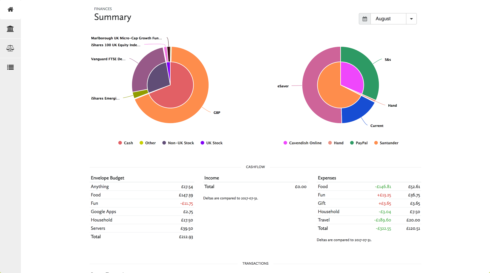

hledger visualiser
==================

This is a little tool I've been writing to visualise
my [hledger](http://hledger.org/) records.  Tables and textual reports
are nice but sometimes visualisations, such as graphs, can really give
you new insights into your data.



**Disclaimer:** This is primarily written for me, by me.  It probably
won't work if you have a more financially complicated life than me.
The following things definitely don't work, and there may be more
things that accidentally don't work:

1. Postings with an implicit amount which involves multiple
   commodities.  For example:

    ```
    2017/07/30 I am very international and have multiple currencies
        accounts:cash:paypal  -20 GBP
        accounts:cash:paypal  -10 EUR
        accounts:cash:bank:checking
    ```

2. Postings which do not involve your *default commodity* (see the
   example config file) at all.  So if my default commodity is not
   "CAD", this would not work:

     ```
     2017/07/30 I am currently in Canada
         expenses:syrup  30 CAD
         accounts:cash:wallet
     ```

     On the other hand, if I paid with my UK debit card which did the
     currency conversion for me, this would be fine:

     ```
     2017/07/30 I am currently in Canada
         expenses:syrup  30 CAD @@ £19
         accounts:cash:bank:checking
     ```

3. Asset or expense accounts with negative balances; liability or
   income accounts with positive balances.

But if you just have a fairly simple financial life where you do
everything in one currency (or only buy and sell other commodities in
your normal currency), this should work for you.


Building
--------

### Backend

Build and run with `stack`:

```bash
cd backend
stack build
stack exec backend ../config.example.yaml
```

If no argument is given, a file `./config.yaml` is tried.

### Frontend

Fetch dependencies with `yarn`:

```back
cd frontend
yarn install
```

(or just find the appropriate .js files on their source websites)

Also fetch the webfonts:

- The Calluna Sans regular font face (the free one) from https://www.fontspring.com/fonts/exljbris/calluna-sans,
  saved as `CallunaSansRegular.woff2`
- The Noto Serif latin font face from https://fonts.google.com/?selection.family=Noto+Serif,
  saved as `NotoSerifRegular.woff2`

And copy everything to the directory your `config.yaml` says to serve
static files from:

```bash
mkdir -p ../web/vendor
cp node_modules/highcharts/highcharts.js    ../web/vendor/highcharts.min.js
cp node_modules/highcharts/modules/stock.js ../web/vendor/highstock.min.js
cp node_modules/mustache/mustache.min.js    ../web/vendor/mustache.min.js
cp CallunaSansRegular.woff2 NotoSerifRegular.woff2 ../web/fonts/
cp src/* ../web/
```


Interface
---------

### Keybindings

**Summary:**

- `left`:  go to prior month (if not January)
- `right`: go to next month (if not December)
- `r`: re-draw charts
- `s`: show asset summary
- `h`: show historical balances

**Balance Sheet:**

- `left`:  go to prior month (if not January)
- `right`: go to next month (if not December)

**Cashflow:**

- `r`: re-draw charts

### Clicky Things

- Names in chart legends
